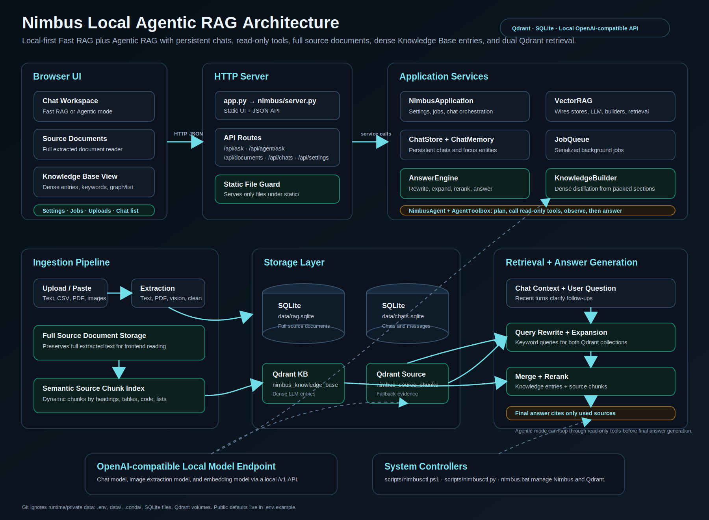
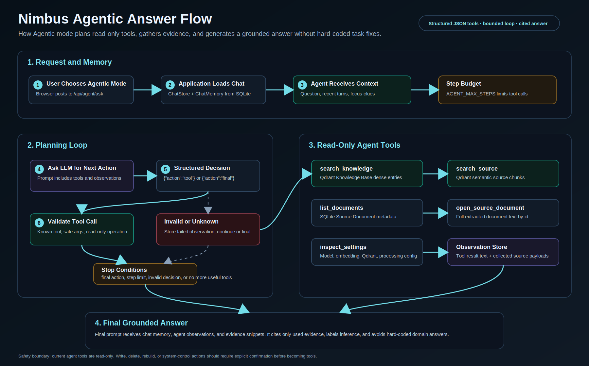
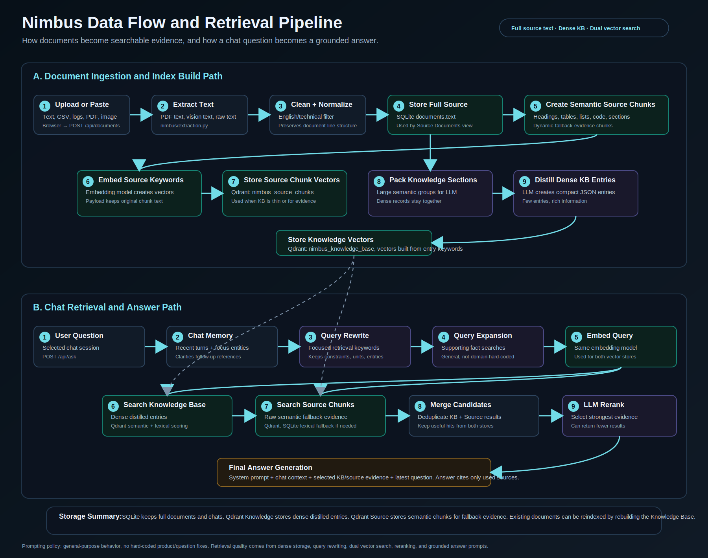

# Nimbus Vector RAG

A local agentic RAG system with a dark web UI. SQLite stores Source Documents
as full extracted text for reading. Qdrant stores two vector collections:
compact LLM-built Knowledge Base entries and semantic Source Base chunks used
as fallback evidence. The app can answer through a fast RAG path or through an
agentic tool loop that plans read-only searches, gathers evidence, and then
generates a grounded answer through an OpenAI-compatible LM Studio endpoint.

## Architecture



```text
Browser UI
  |
  |  upload files / manage chats / ask questions / inspect sources
  v
Python HTTP Server: app.py -> nimbus/server.py
  |
  |-- Static UI: static/index.html, app.js, styles.css
  |
  |-- API
      |-- GET    /api/health
      |-- GET    /api/chats
      |-- GET    /api/chats/{id}/messages
      |-- GET    /api/documents
      |-- GET    /api/documents/{id}/chunks
      |-- GET    /api/search
      |-- GET    /api/knowledge
      |-- GET    /api/jobs
      |-- POST   /api/chats
      |-- POST   /api/chats/{id}/rename
      |-- POST   /api/chats/{id}/delete
      |-- POST   /api/documents
      |-- POST   /api/documents/{id}/build-knowledge
      |-- POST   /api/ask
      |-- POST   /api/agent/ask
      |-- POST   /api/rebuild-knowledge
      |-- DELETE /api/documents/{id}
  |
  v
Nimbus package: nimbus/
  |
  |-- server.py: API routes and app settings
  |-- application.py: runtime orchestration, settings, jobs, chats, RAG and agent paths
  |-- agent.py: bounded agent loop for planning tools, collecting observations, and final answers
  |-- tools.py: modular read-only agent tool registry
  |-- extraction.py: file parsing, PDF text extraction, base64 validation
  |-- jobs.py: in-memory background job queue and progress tracking
  |-- prompts.py: project prompting policy and LLM prompts for Knowledge Base building, image extraction, retrieval, answers, and agent decisions
  |-- rag.py: RAG core, Source Document store, Qdrant vector stores, LM Studio calls
  |-- answer_engine.py: fast RAG query rewrite, expansion, reranking, and answer generation
  |-- source_chunks.py: semantic Source Base chunk indexing into Qdrant
  |
  v
SQLite DB: data/rag.sqlite
  |
  |-- documents table
  |-- full extracted source text for frontend reading
  |
  v
Qdrant Vector DB
  configured by QDRANT_URL
  knowledge collection configured by QDRANT_COLLECTION
  source chunk collection configured by QDRANT_SOURCE_COLLECTION
  |
  |-- Knowledge Base entry vectors built from keywords
  |-- Source Base semantic chunk vectors built from keywords
  |-- payload: document id, file name, keywords, information, source section
  |
  v
LM Studio OpenAI-compatible endpoint
configured by OPENAI_BASE_URL
model configured by OPENAI_MODEL
image extraction model configured by IMAGE_MODEL
```

## Data Stores

There are three logical stores in the app:

```text
Source Documents
  Stores full cleaned source text in SQLite.
  Used by the Source Documents frontend view.

Knowledge Base
  Stores LLM-generated English entries distilled from large semantic source sections.
  Each point vector is built from keywords.
  Each payload stores keywords, information, document name, source section,
  embedding model, and prompt version.

Source Base chunks
  Stores semantic source chunks in Qdrant using the same payload shape.
  Used as fallback evidence and confirmation for final answers.
```

## Ingestion Flow

```text
User uploads/pastes content
  |
  v
POST /api/documents
  |
  |-- text/log/csv/md/json
  |     -> English filter
  |     -> store full extracted text in SQLite
  |     -> semantic chunk by headings, tables, lists, code, and paragraphs
  |     -> embed source chunk keywords into Qdrant
  |     -> optional Knowledge Base entries
  |
  |-- PDF
  |     -> pypdf text extraction
  |     -> English filter
  |     -> store full extracted text in SQLite
  |     -> semantic chunk by document structure
  |     -> embed source chunk keywords into Qdrant
  |     -> optional Knowledge Base entries
  |
  |-- image
      -> send image to the configured IMAGE_MODEL
      -> extract Source Document observations
      -> store full extracted text in SQLite
      -> semantic chunk and embed source chunk keywords into Qdrant
      -> build Knowledge Base entries
```

Supported uploads include images (`.png`, `.jpg`, `.jpeg`, `.webp`, `.gif`,
`.bmp`), PDFs, and plain text-style files such as `.txt`, `.md`, `.csv`, `.json`,
and `.log`.

## Knowledge Base Build Flow

```text
Raw document
  |
  v
split into large semantic sections within the configured model budget
  |
  v
send batches to LM Studio
  KNOWLEDGE_CONCURRENCY=1 by default
  |
  v
LLM produces JSON Knowledge Base entries
  compact notes, tables, bullets, trees, procedures, or summaries
  |
  v
embed each Knowledge Base entry's keywords
  |
  v
store Knowledge Base points with readable information payloads
```

## Question Answering Flow

Nimbus has two chat answer modes:

```text
Fast RAG
  POST /api/ask
  -> query rewrite
  -> query expansion
  -> Knowledge Base + Source chunk retrieval
  -> optional LLM rerank
  -> final grounded answer

Agentic
  POST /api/agent/ask
  -> bounded tool-planning loop
  -> read-only tool execution
  -> observations + evidence collection
  -> final grounded answer
```

```text
User question
  |
  v
Attach persistent chat session context
  selected chat's recent user/assistant turns
  |
  v
LLM query rewrite
  Example:
  "what is my laptops cpu?"
  ->
  "laptop cpu central processing unit processor model system information..."
  |
  v
Search both:
  - rewritten query
  - original question
  |
  v
Search Qdrant Knowledge Base and Qdrant Source Base chunks
  |
  v
Merge useful candidates from both stores
  |
  v
Build grounded context
  |
  v
Send context + question to the configured chat model
  |
  v
Return answer + source dropdowns
```

Chats are persisted in SQLite at `data/chats.sqlite`. The answer engine passes
recent turns from the selected chat as conversation context, which helps
follow-up questions resolve the previous subject without turning old answers
into evidence. Grounding still comes from the Knowledge Base and Source Base.

## Agentic Flow



Agentic mode adds a controlled planning layer on top of retrieval. The model
does not directly run code or change the system. It returns structured JSON
tool decisions, and the backend validates the requested tool and arguments
before executing the read-only operation.

```text
User asks in Agentic mode
  |
  v
NimbusApplication loads chat memory
  |
  v
NimbusAgent asks the LLM for the next action
  |
  |-- {"action":"tool", "tool":"search_knowledge", "arguments":{...}}
  |-- {"action":"tool", "tool":"search_source", "arguments":{...}}
  |-- {"action":"tool", "tool":"list_documents", "arguments":{...}}
  |-- {"action":"tool", "tool":"open_source_document", "arguments":{...}}
  |-- {"action":"tool", "tool":"inspect_settings", "arguments":{...}}
  |-- {"action":"final"}
  |
  v
AgentToolbox validates and executes read-only tools
  |
  v
NimbusAgent stores observations and source evidence
  |
  v
Loop continues until the model chooses final or AGENT_MAX_STEPS is reached
  |
  v
Final answer prompt receives chat memory, observations, and evidence snippets
```

The agent currently exposes these read-only tools:

| Tool | Purpose |
| --- | --- |
| `search_knowledge` | Search compact distilled Knowledge Base entries. |
| `search_source` | Search semantic Source Document chunks for raw fallback evidence. |
| `list_documents` | List uploaded Source Documents. |
| `open_source_document` | Open full extracted text for one Source Document by id. |
| `inspect_settings` | Inspect runtime model, embedding, retrieval, and processing settings. |

Tool-loop depth is controlled by:

```text
AGENT_MAX_STEPS=6
```

The prompt policy in `nimbus/prompts.py` applies to both Fast RAG and Agentic
mode: fixes should be general technical or prompt-engineering improvements, not
hard-coded answers for a specific product, file, number, or user question.

## Retrieval



The system uses semantic embeddings from LM Studio and stores them in Qdrant.

```text
Knowledge Base entry keywords
  -> /v1/embeddings
  -> configured embedding model
  -> normalize
  -> Qdrant point vector
  -> payload stores readable information and source metadata
```

At search time:

```text
Qdrant semantic vector similarity in both collections
+ small lexical overlap score
+ LLM reranking
= ranked Knowledge Base entries and Source Base chunks
```

SQLite is still used because it is excellent for local document metadata and
full-document inspection. It does not own embeddings anymore. Qdrant is the true
vector database used for similarity search. Existing Source Documents can be
rebuilt into both Qdrant collections through `POST /api/rebuild-knowledge`.

## Qdrant Setup

Qdrant is the vector database for the Knowledge Base. Start it before building
or searching the Knowledge Base.

## System Control

Use the project controller to start, stop, restart, and inspect the whole local
system. It manages:

- Nimbus web server
- Docker Qdrant container
- runtime PID file
- stdout/stderr logs under `data/runtime/`

From PowerShell:

```powershell
.\scripts\nimbusctl.ps1 status
.\scripts\nimbusctl.ps1 start
.\scripts\nimbusctl.ps1 stop
.\scripts\nimbusctl.ps1 restart
```

Cross-platform controller for Windows, macOS, and Linux:

```bash
python scripts/nimbusctl.py status
python scripts/nimbusctl.py start
python scripts/nimbusctl.py stop
python scripts/nimbusctl.py restart
```

From Command Prompt:

```cmd
nimbus status
nimbus start
nimbus stop
nimbus restart
```

Start only Qdrant:

```powershell
.\scripts\nimbusctl.ps1 start-qdrant
```

Stop only Qdrant:

```powershell
.\scripts\nimbusctl.ps1 stop-qdrant
```

Stop Nimbus but keep Qdrant running:

```powershell
.\scripts\nimbusctl.ps1 stop -KeepQdrant
```

Run Nimbus in the foreground for debugging:

```powershell
.\scripts\nimbusctl.ps1 start -Foreground
```

The older convenience scripts still work:

```powershell
.\scripts\start_all.ps1
.\scripts\stop_all.ps1
.\scripts\restart_all.ps1
.\scripts\status.ps1
```

### Option A: Project Script

If Docker Desktop is installed and running, the simplest path is:

```powershell
.\scripts\start_qdrant.ps1
```

Or start Qdrant and Nimbus together:

```powershell
.\scripts\start_all.ps1
```

The scripts read these values from `.env`:

```text
QDRANT_URL=http://127.0.0.1:6333
QDRANT_PORT=6333
QDRANT_COLLECTION=nimbus_knowledge_base
QDRANT_SOURCE_COLLECTION=nimbus_source_chunks
QDRANT_RUNTIME=docker
QDRANT_CONTAINER_NAME=nimbus-qdrant
QDRANT_DOCKER_IMAGE=qdrant/qdrant:latest
QDRANT_DOCKER_VOLUME=nimbus_qdrant_storage
```

### Option B: Manual Docker Commands

Create a persistent Docker volume:

```powershell
docker volume create nimbus_qdrant_storage
```

Start Qdrant:

```powershell
docker run -d `
  --name nimbus-qdrant `
  -p 6333:6333 `
  -p 6334:6334 `
  -v nimbus_qdrant_storage:/qdrant/storage `
  qdrant/qdrant:latest
```

Verify it is running:

```powershell
docker ps --filter "name=nimbus-qdrant"
```

Check the Qdrant API:

```powershell
Invoke-WebRequest http://127.0.0.1:6333/collections -UseBasicParsing
```

Open the Qdrant dashboard:

```text
http://localhost:6333/dashboard
```

### Docker Maintenance

Stop Qdrant:

```powershell
docker stop nimbus-qdrant
```

Start it again:

```powershell
docker start nimbus-qdrant
```

Remove the container but keep the stored vectors:

```powershell
docker rm -f nimbus-qdrant
```

Delete all Qdrant vector data:

```powershell
docker rm -f nimbus-qdrant
docker volume rm nimbus_qdrant_storage
```

After deleting the volume, create it again and rerun the `docker run` command.

Qdrant must be running for semantic retrieval. SQLite no longer stores vectors,
so it is not a semantic-search fallback.

## UI

```text
Web interface
  |
  |-- left sidebar
  |     |-- upload / paste / index
  |     |-- persistent chat list
  |     |-- chat rename/delete actions
  |     |-- background operations
  |
  |-- top view switch
  |     |-- Chat
  |     |-- Knowledge Base
  |     |-- Source Documents
  |
  |-- chat area
        |-- user/assistant bubbles
        |-- source dropdown per answer
        |-- rendered Markdown for Knowledge Base entries and Source Base chunks
```

## Main Files

```text
app.py
  small entrypoint that starts Nimbus

nimbus/server.py
  HTTP handler and API routing only

nimbus/application.py
  Application service object, settings, background task wiring, chat flow

nimbus/answer_engine.py
  Query rewrite, follow-up handling, context selection, reranking, answer formatting

nimbus/extraction.py
  file parsing, image/PDF dispatch, concurrent PDF page extraction

nimbus/chat_memory.py
  Small in-memory rolling chat memory and focus tracking

nimbus/chat_store.py
  Persistent SQLite chat sessions and message history

nimbus/jobs.py
  in-memory job queue, serialized execution, progress state

nimbus/knowledge.py
  Knowledge Base build orchestration from large semantic source sections

nimbus/llm.py
  OpenAI-compatible chat and embedding client

nimbus/models.py
  Shared data models

nimbus/text_processing.py
  text normalization, English filtering, semantic chunking, stable hashes

nimbus/knowledge_parser.py
  parser for LLM-produced Knowledge Base JSON or fallback Markdown

nimbus/retrieval.py
  retrieval scoring, follow-up focus, reranking helpers, context formatting

nimbus/source_store.py
  SQLite Source Document storage, migrations, full-document access, lexical fallback search

nimbus/source_chunks.py
  semantic Source Base chunk indexing into the Qdrant source chunk collection

nimbus/vector_store.py
  Qdrant collection storage, vector collection management, semantic search

nimbus/rag.py
  Thin facade that wires Source Base, Knowledge Base, LLM, builder, and answer engine

nimbus/prompts.py
  Project prompting policy and templates for Knowledge Base building, image extraction,
  query rewrite, answer generation, and reranking

static/index.html
  UI structure

static/app.js
  browser logic, uploads, persistent chats, source/knowledge views, Markdown rendering

static/styles.css
  dark professional UI styling

data/rag.sqlite
  persistent document metadata and full extracted source text

data/chats.sqlite
  persistent chat sessions and message history

storage/
  legacy local Qdrant storage path; Docker Qdrant normally uses its named volume
```

## Run

Create `.env` from `.env.example`, install Python dependencies, start your
configured LM Studio chat and embedding models, then run both services:

```powershell
python -m pip install -r requirements.txt
```

```powershell
.\scripts\nimbusctl.ps1 start
```

Cross-platform:

```bash
python scripts/nimbusctl.py start
```

Open:

```text
http://localhost:8000
```

Qdrant dashboard:

```text
http://localhost:6333/dashboard
```

## Configuration

Private runtime settings live in `.env`, which is ignored by git. Use
`.env.example` as the template.

```text
OPENAI_BASE_URL=http://127.0.0.1:1234/v1
OPENAI_MODEL=<chat-model-name>
IMAGE_MODEL=<image-capable-chat-model-name>
EMBEDDING_MODEL=<embedding-model-name>
OPENAI_API_KEY=local-key
PORT=8000
HOST=127.0.0.1
RAG_DB=./data/rag.sqlite
KNOWLEDGE_GROUP_CHUNKS=30
KNOWLEDGE_MAX_TOKENS=12000
KNOWLEDGE_CONCURRENCY=1
SOURCE_CHUNK_MAX_WORDS=650
EXTRACTION_WORKERS=12
CHAT_MEMORY_TURNS=24
CHAT_MEMORY_SUMMARY_CHARS=700
CHAT_MEMORY_MESSAGE_CHARS=4000
AGENT_MAX_STEPS=6
VECTOR_BACKEND=qdrant
QDRANT_URL=http://127.0.0.1:6333
QDRANT_PORT=6333
QDRANT_COLLECTION=nimbus_knowledge_base
QDRANT_SOURCE_COLLECTION=nimbus_source_chunks
QDRANT_RUNTIME=docker
QDRANT_CONTAINER_NAME=nimbus-qdrant
QDRANT_DOCKER_IMAGE=qdrant/qdrant:latest
QDRANT_DOCKER_VOLUME=nimbus_qdrant_storage
```

Environment variables override `.env` values if they are already set before
starting the app.

## Strengths

- Runs locally.
- Uses the LM Studio OpenAI-compatible endpoint.
- Supports text, PDF, CSV/log/article-style text, and images.
- Separates raw evidence from LLM-built Knowledge Base entries.
- Uses the configured semantic embedding model.
- Uses LLM query rewriting before retrieval.
- Uses concurrent CPU-side PDF extraction.
- Uses serialized LLM jobs by default for local-model stability.
- Lets you inspect databases, documents, chunks, answers, and sources.

## Limitations

- Qdrant must be running for semantic retrieval.
- PDF image-only/scanned pages are not yet rendered page-by-page into vision text.
- Markdown rendering is intentionally minimal and safe.
- Jobs are in-memory, so progress history resets when Nimbus restarts.
